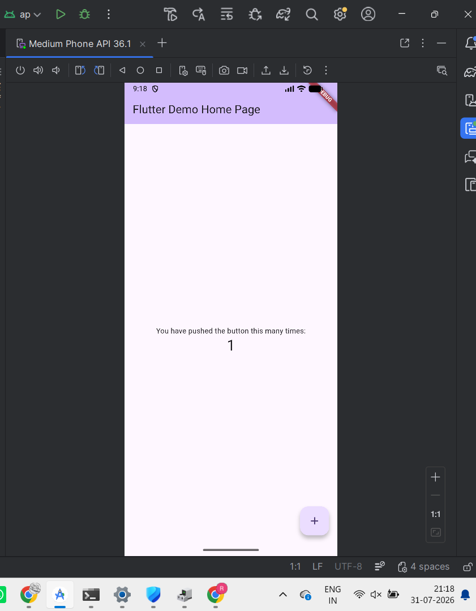

# Day 0 - Flutter Environment Setup

## What I did
- Installed Flutter SDK.
- Installed Android Studio and required SDK components.
- Created my first Flutter project.
- Configured the Android emulator.
- Set up Git and GitHub repository.
- Successfully built and ran the default Flutter application.

## What I learned
- Flutter project structure.
- How to create a Flutter project.
- How to run an app on an Android emulator.
- Basic Git workflow for Flutter projects.

## Status
 Flutter environment successfully configured.
 ## Screenshot

