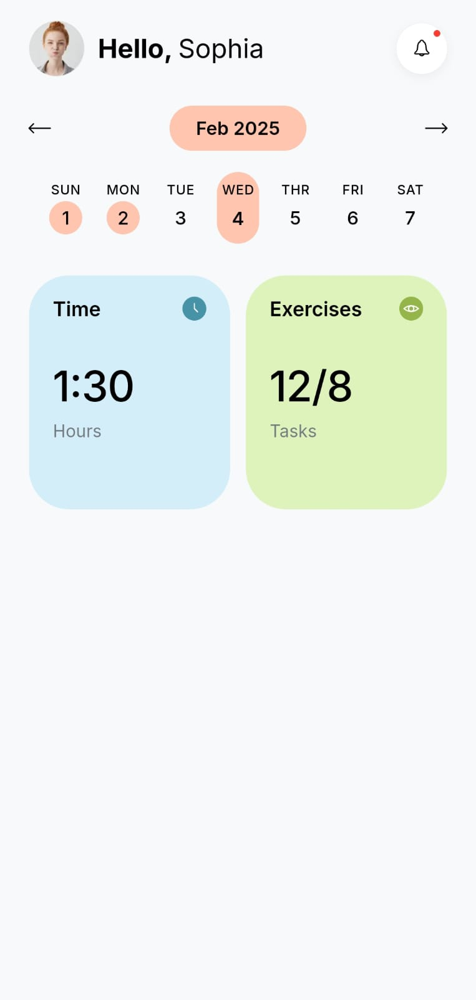

# Flutter UI Challenge - Day 1

## Objective
Recreate the provided fitness dashboard UI in Flutter as closely as possible.

## What I Learned

Today I focused on understanding how to build a clean UI using Flutter widgets.

Things I learned:
- Structuring a Flutter screen using Rows, Columns, Containers and Stack.
- Creating reusable widgets for different UI sections.
- Using a centralized design system for colors, spacing and typography.
- Working with border radius and padding to achieve a clean design.
- Matching a UI reference by adjusting spacing, colors and alignment.
- Organizing the project into smaller reusable components instead of writing everything in one file.

## Challenges I Faced

- Matching the exact colors from the reference UI.
- Getting the Month selector and selected date capsule to look identical to the design.
- Finding icons that closely matched the reference.
- Maintaining proper spacing inside the statistic cards.
- Achieving pixel-perfect alignment between all calendar elements.
- Understanding that even small differences in padding or border radius can noticeably change the final UI.

## Progress

Completed:
- Header section
- Calendar section
- Statistic cards
- Basic design system
- Responsive Flutter layout

Still Improving:
- Pixel-perfect spacing
- Icon matching
- Color accuracy
- Border radius fine tuning
- Final visual polish

## Reflection

Today's work helped me understand how much attention to detail is required to recreate a professional UI. Small adjustments in spacing, colors and typography can make a big difference. I'll continue refining the screen until it closely matches the original design.

## ScreenShot

