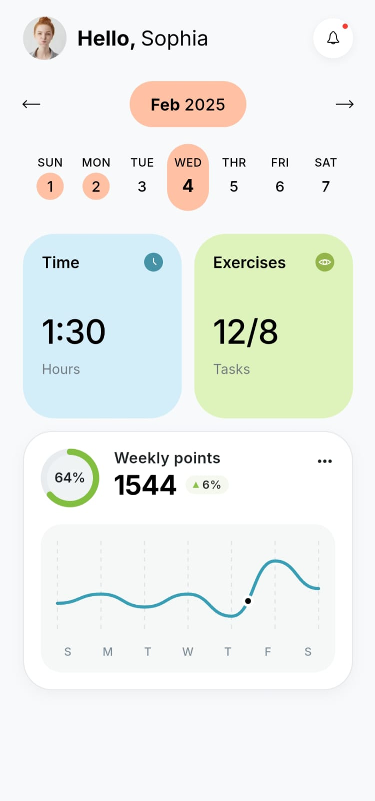

# Flutter UI Challenge - Day 2

## Overview

Today I recreated the second  part of the first screen UI design in Flutter while keeping it as a completely separate project from Day 1. 
The main goal was to improve my Flutter UI skills by matching the given design as closely as possible.

## What I Learned

- Creating custom calendar layouts.
- Designing reusable dashboard cards.
- Using gradients and rounded containers.
- Building a custom circular progress indicator.
- Creating a smooth weekly line graph.
- Improving spacing, alignment, and typography for a cleaner UI.
- Understanding how small UI details make a big difference.

## Challenges Faced

- Keeping Day 1 and Day 2 as independent Flutter projects.
- Matching the exact spacing and sizing from the design.
- Replicating the circular progress indicator correctly.
- Styling the weekly points card to closely match the reference.
- Fine-tuning the graph marker and progress ring.
- Making the overall UI look pixel-perfect across different sections.

## Tech Stack

- Flutter
- Dart
- Material Design

## Status

✅ Day 2 balace part of the UI Completed

Further refinements can still be made to achieve an even closer pixel-perfect match with the reference design.

## ScreenShot

