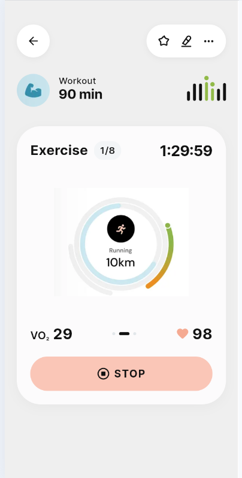

## What I Learned
-Improved my understanding of building pixel-perfect Flutter UIs by refining spacing, alignment, colors, and reusable widgets.
-Learned that custom designs like circular progress rings often require a CustomPainter instead of standard progress widgets.
-Gained more experience comparing a Flutter UI with a design reference and making iterative visual improvements.
## Changes Made
-Refined the Workout Details screen, including layout, spacing, colors, icons, and card styling to closely match the reference.
-Updated the circular activity ring, Weekly Points section, and top header through multiple UI refinements.
-Organized the code into reusable widgets and constants to improve readability and maintainability.
## Challenges Faced
-Achieving a pixel-perfect match for the circular activity ring and overall layout.
-Fine-tuning small spacing, padding, and alignment differences to match the reference exactly.
-Selecting and adjusting icons, colors, and component sizes to closely replicate the original design.

✅ Day 3 done half part of the UI Completed

Further refinements can still be made to achieve an even closer pixel-perfect match with the reference design.

## ScreenShot
