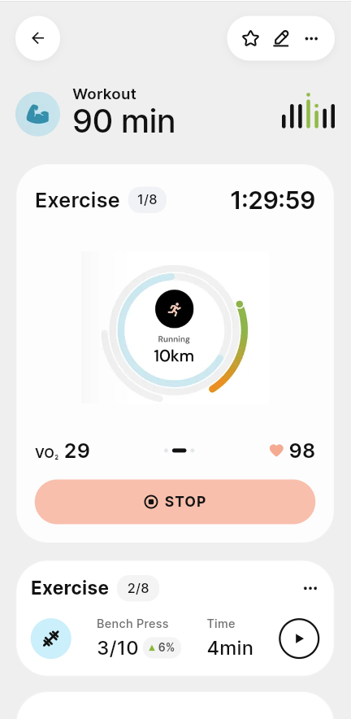

# Day 4 - Pixel Perfect UI Refinement

## What I Learned

- Learned how important typography, spacing, and alignment are in creating a pixel-perfect UI.
- Understood that matching the overall screen composition is just as important as matching individual widgets.
- Learned how to analyze a reference design carefully and convert it into clear implementation requirements for Flutter.

## What I Changed

- Refined the Workout Details screen to closely match the provided reference design.
- Improved the layout by adjusting spacing, typography, card proportions, icons, and button sizes.
- Planned a custom implementation for the circular progress gauge and mini equalizer to achieve an exact visual match.
- Focused on reducing unnecessary whitespace and maintaining the same vertical rhythm as the reference.
- Created a detailed implementation plan with visual validation and overlay comparison to ensure pixel-perfect accuracy.

## Difficulties Faced

- Achieving a true pixel-perfect layout was challenging because even small differences in spacing or typography changed the overall appearance.
- The circular progress gauge and mini equalizer required careful planning since the default Flutter widgets could not fully match the reference.
- Maintaining the correct overall screen proportions while keeping the layout responsive required multiple refinements.

## Current Status
  -completed the balance part of the screen 2
  -Further refienment is can be made  to match the reference design completely

  ## ScreenShot
  